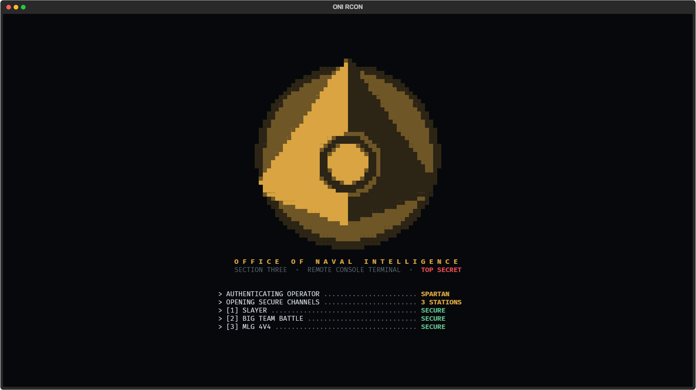
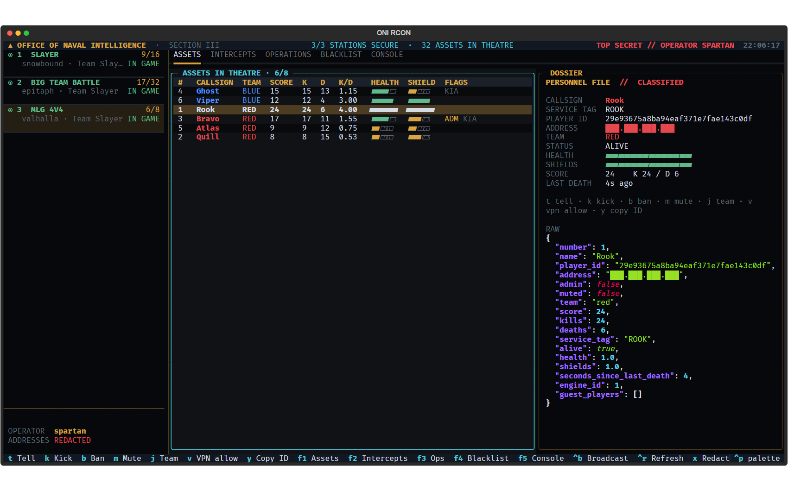
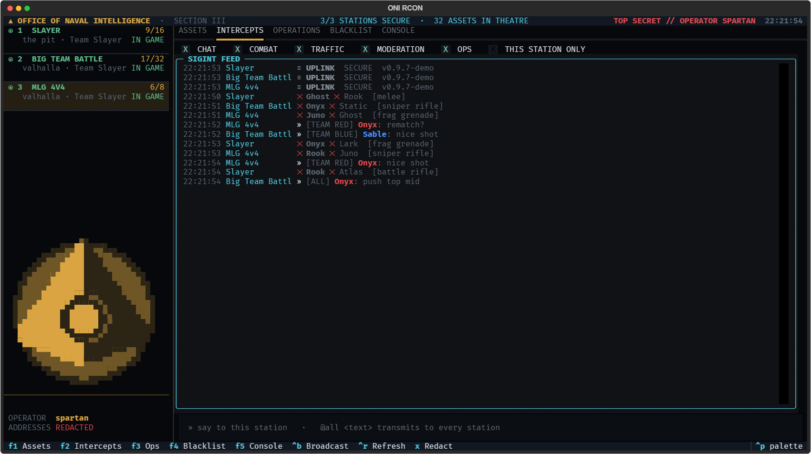
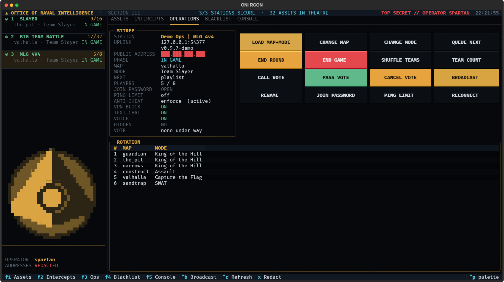
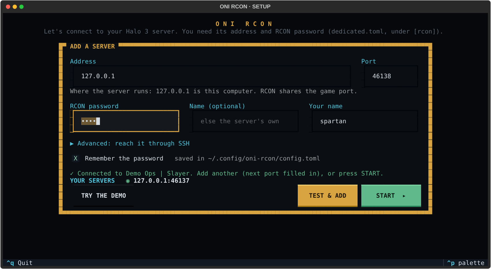

# oni-rcon



**An ONI-themed terminal admin console for Project Reclaimer Halo 3 dedicated servers.**
Every server you run on one screen: players, live intercepts, kicks and bans, map and mode control, votes, VPN
allowances and a raw command console, wrapped in Office of Naval Intelligence, Section Three dossier styling.



**[Download for Windows](https://github.com/viik2k/oni-rcon/releases/latest/download/oni-rcon-windows-x64.exe)** · [Linux](https://github.com/viik2k/oni-rcon/releases/latest/download/oni-rcon-linux-x64) ·
or `uv tool install git+https://github.com/viik2k/oni-rcon`. The first time it opens a setup screen: type your server's
address and RCON password, it tests them, and you're in. Or choose **Try the demo** to look around three simulated
servers first.

## What it does

| Tab | |
|---|---|
| **F1 Assets** | Live player table per server: team, score, K/D, health and shield bars, admin, dead and spree flags, and the score race between the teams along the bottom. The dossier shows the selected player's file, a biometric glyph drawn from their player ID, the medals they've earned and the raw JSON. `t` tell · `k` kick · `b` ban · `m` mute · `j` team · `v` VPN allow · `y` copy ID |
| **F2 Intercepts** | One feed from every server: chat (team and server), kills with weapon, joins, leaves, kicks, bans, votes and game phases. Kills carry their Halo 3 medals: double kill through killionaire, killing spree through invincible, and killjoy. Filter by chat, combat, traffic, moderation or ops; scroll up to read back and it holds still. Chat that mentions admins or cheating raises a toast and the terminal bell |
| **F3 Operations** | Sitrep for the selected server with the vote under way and its tally, and the title and author of the map or gametype playing when it came from ReclaimerForge; the theatre, with each team's numbers and score as bars, the top guns and who's on a spree; the playlist rotation with the current map marked; and buttons for load map + mode, change map or mode, queue next, end round or game, shuffle, team count, call, pass or cancel a vote, broadcast, rename, join password and ping limit |
| **F4 Blacklist** | Bans by player, IP and device; new ban (timed or permanent), unban, VPN allow and revoke, check an IP |
| **F5 Console** | Type any RCON command (`help` lists them) with ↑/↓ history. The command log records everything sent from this session and its replies. The message in `say`, `tell`, `kick` and `servername` is the rest of the line as typed, sent as one argument, so it needs no quotes |
| **F6 Forge** | The [ReclaimerForge](https://www.reclaimerforge.net) catalog of community maps, gametypes and playlists, read with your own API key. Order it by trending, rising, latest, updated, downloads, rated, unrated or overlooked (trending and rising over the last 24 hours, 7 days or 30 days), or see the collections ReclaimerForge is featuring now, and search it. Each listing shows its type, authors, thumbs up and down, recent downloads, and whether it runs on the selected server's version; its file lists every version, and any of them installs on the selected server, every file checked against Forge's manifest. `i` install on this server · `l` load it now · `s` sort · `w` window · `/` search · `n` more · `k` key · `y` copy ID |

Also:

- **No config file needed.** The setup screen adds servers for you and tests each one first. **+ ADD SERVER** in the
  sidebar brings it back later.
- **Point and click.** Every action has a button, every button explains itself when the mouse rests on it, and `?`
  opens a plain-words guide to the whole console.
- **Errors you can act on.** A server that won't connect says why ("Nothing answered on that port", "SSH refused your
  key") and counts down to its next try.
- **Many servers at once.** The sidebar holds one card per server, and `1`–`9` jumps between them; `g` lists every
  server, the busiest first, to type a name into. Each card shows how full the server is and a trace of its activity
  over the last 100 seconds. Names that share a community tag ("ALPHA · Big Team") are shortened to what tells them
  apart, with the tag on the card's second line.
- **Built for fleets.** Past 12 servers the cards slim to two lines, the boot screen tallies the stations instead of
  listing each one, and the console stays light enough for a web terminal: a card is redrawn only when what it shows
  changes, status polls are spread over 15 seconds instead of fired together, and servers sign in 8 at a time with
  jittered reconnects.
- **An alert condition.** The masthead reads CONDITION GREEN; AMBER while a station is down or something you installed
  from Forge has been withdrawn; RED when a call for an admin or an anti-cheat hit comes in. A server you aren't looking at pulses red and keeps a ⚑ count until you open it
  or the Intercepts tab.
- **The Superintendent.** A small green face at the bottom of the sidebar, on every tab, that watches the feed of every
  server and reacts as an admin would: it welcomes a join, startles at a call for an admin, scowls at a cheat flag,
  approves a kick or a ban, is impressed by a medal, is unimpressed by a mute and winks at the server's own messages.
  The word under it says how it feels, and the words beside it say what it reacted to, with addresses redacted like
  everywhere else. It blinks now and then. It takes a moment to settle into each mood and then relaxes, a busy fleet
  doesn't make it flicker, and an alert pulses it red until it's over. It is drawn the way the emblem is, from the
  Halo ASCII archive piece, and it never goes away: it grows to 16 pixels across when the terminal is tall enough,
  shrinks to 12 and then 8 as it gets short, and the station list scrolls to make room before the Superintendent or
  the operator line does. With `TEXTUAL_ANIMATIONS=none` it changes expression at once and never blinks.
- **Broadcast to one server or all.** `Ctrl+B`. `@all` messages and commands go out 4 servers at a time, each reply
  goes in the command log on one line, and a tally closes it ("79 stations · 77 ok · 2 no reply yet"). A command that
  gets no reply in 10 seconds is never resent, and if its reply comes later the log shows it.
- **Command palette.** `Ctrl+P`.
- **Player addresses are redacted by default,** in the tables, the feed, the toasts and the console's replies and raw
  events. Press `x` to reveal them. This helps when you stream or share screenshots.
- **SSH tunnels are built in.** One `ssh -L` per host carries every server on it, and it reconnects with backoff.
- **Destructive actions ask first.** The confirm button defaults to ABORT.
- **A refused password is never retried.** The server locks an address out after 5 wrong passwords in 10 minutes, so
  oni-rcon won't trip it. RECONNECT on F3 asks for the password again before it tries.
- **Medals count what the console has seen.** They're worked out from the kill feed, so a spree that started before
  oni-rcon connected isn't known, and a reconnect starts everyone's spree over.

<p>
  
  
</p>

## Install

You need a Project Reclaimer dedicated server with RCON turned on (tested against 0.9.7).

**Windows:** download [`oni-rcon-windows-x64.exe`](https://github.com/viik2k/oni-rcon/releases/latest/download/oni-rcon-windows-x64.exe) and double-click it. The build
isn't code-signed, so SmartScreen may stop it the first time: choose **More info**, then **Run anyway**. The setup screen
takes it from there.

**Linux:**

```
curl -Lo oni-rcon https://github.com/viik2k/oni-rcon/releases/latest/download/oni-rcon-linux-x64
chmod +x oni-rcon
./oni-rcon --demo
```

**With Python 3.11+** (any OS, macOS included):

```
uv tool install git+https://github.com/viik2k/oni-rcon
```

or `pipx install git+https://github.com/viik2k/oni-rcon`. From a clone, `uv tool install .` also works.

**Updates.** The downloads update themselves: at start they check GitHub for a newer release, swap it in, and tell you
to restart. A Python install tells you to run `uv tool upgrade oni-rcon` instead. Set `ONI_RCON_NO_UPDATE=1` to turn
the check off.

Use a terminal with true colour and a font that has box-drawing glyphs, such as Windows Terminal, iTerm2, kitty or
WezTerm. At least 140×40 looks best.

## Turn on RCON on the server

In `dedicated.toml`:

```toml
[rcon]
password = "a long random string"   # off while empty; 8 characters at least
address = "127.0.0.1"               # keep it: RCON is not encrypted
```

With the Docker image, set `RECLAIMER_DEDICATED_RCON_PASSWORD` in the container's environment instead, and keep the
real value in an `.env` that never goes into Git. Each server listens on its own **game port** over TCP. To change
that, set `rcon_port` (and optionally `rcon_password`) in that server's `[[server]]` block. Restart the server.

## Connect

The easy way is the setup screen: it opens by itself the first time, from **+ ADD SERVER** in the sidebar, or with
`oni-rcon --setup`. It adds each server to your config file (below), keeps any comments and settings already there,
and saves the password only if you leave **Remember the password** ticked.



From the command line:

```
oni-rcon 11774                                # a server on this machine
oni-rcon 11774 11775 11776                    # several at once
oni-rcon --ssh admin@game-box 11774 11775     # through an SSH tunnel to the game box
oni-rcon wss://rcon.example.org/slayer        # behind a TLS reverse proxy
```

Each target is `PORT`, `HOST:PORT`, `[IPv6]:PORT` or a `ws://` / `wss://` URL. With `--ssh`, `HOST` is resolved on
the SSH destination, so the default `127.0.0.1` means "the game box itself". The tunnel needs key authentication
(`BatchMode=yes`): load your key into an agent or set it in `~/.ssh/config`.

oni-rcon finds the password in this order:

1. the config file's `password`, `password_env` or `password_command`
2. `$ONI_RCON_PASSWORD`
3. a single prompt shared by every server

The name the server's admin log records you under is `--by`, then the config's `by`, then your login name.

### Config file

With no targets on the command line, oni-rcon reads the first of these that exists:

1. `$ONI_RCON_CONFIG`
2. `./oni-rcon.toml`, which is the exe's own folder when you double-click it
3. `%APPDATA%\oni-rcon\config.toml` on Windows, or `~/.config/oni-rcon/config.toml` on Linux and macOS

Start from [`oni-rcon.example.toml`](oni-rcon.example.toml). A typical host setup tunnels to the game box and reads
the password from the server's own `.env` over SSH, so the password never sits on your machine:

```toml
by = "your-name"

[defaults]
ssh = "admin@game-box"
password_command = ["ssh", "-o", "BatchMode=yes", "admin@game-box",
                    "sed -n 's/^RECLAIMER_DEDICATED_RCON_PASSWORD=//p' ~/reclaimer/.env"]

[[server]]
port = 11774
[[server]]
port = 11775
```

### Player ping

The PLAYERS tab has a PING column (green under 100 ms, amber under 200, red above). RCON has no ping, so it's the
number the server logs when someone joins, the same one `maxping` uses: a join-time reading, not a live one. To fill
it in, give oni-rcon a command that follows the server log, as a top-level key above the first `[table]`:

```toml
ping_log = "docker logs -f --since 12h my-server-{port}"   # {port} = that server's RCON port
```

It runs on the `ssh` host (or locally when there's none), is restarted if the connection drops, and stops with
oni-rcon. Without it the column shows a dash. The dossier shows the same number as JOIN PING.

## ReclaimerForge

[ReclaimerForge](https://www.reclaimerforge.net) is the community catalog of forged maps, gametypes and playlists for
Reclaimer. oni-rcon reads it with **your own API key**: none ships with oni-rcon, and every admin uses their own.
Without one, everything else works as before. `oni-rcon --demo` brings a pretend Forge to try F6 with.

**Get a key** on reclaimerforge.net. Your account needs the Developer role (an Owner assigns it) and a verified
email. Then open Developer tools and create a named key with the `catalog:read` and `assets:download` scopes, and
nothing more. The key is shown once, when you make it, so save it then. Make one for oni-rcon alone, so you can rotate
it without touching anything else that uses a key: create the replacement, load it into oni-rcon, then revoke the old
one. A key stops working when it expires or is revoked, when its account loses the Developer role or its verified
email, or when the account is banned; F6 then says the key was refused. oni-rcon never writes, uploads or publishes
anything there.

**Give it to oni-rcon.** The first of these that's set wins:

1. `forge_api_key_env = "NAME"` in the config file: the key is in that environment variable
2. `forge_api_key_command = [...]`: the first line a command prints, from your password manager say
3. `$ONI_RCON_FORGE_KEY`

Or press `k` on F6 and type it, for this session. Choose **Remember it** there to save it in the config file instead;
that's off unless you pick it, and the file is then readable only by you.

```toml
forge_api_key_env = "RECLAIMERFORGE_KEY"
# or: forge_api_key_command = ["pass", "show", "reclaimerforge/api-key"]
```

These go at the top of the config file, above `[defaults]` and the `[[server]]` blocks: TOML reads a key that comes
after a table as part of that table.

### Browsing the catalog

`s` steps through the orders: trending, rising, latest, updated, downloads, rated, unrated and overlooked, then
**FAVOURITES** and **INSTALLED HERE**. `w` sets the window (24 hours, 7 days or 30 days) for trending and rising, the
two orders it applies to; it greys out for the rest.

- **Rating** is thumbs up and down, as ReclaimerForge now counts them. *Rated* puts the most thumbs up first, then the
  fewest down, and *unrated* is listings nobody has voted on. Forge's old star rating is archived and isn't shown.
- **Authors.** A listing can have several. All are named, the original owner first, and the owner's ID is beside them.
- **Recent downloads** fill from the day Forge began recording them, and older totals aren't backfilled. Where a window
  reaches back past that day the file says so, because the count then covers only part of it. Downloads through an API
  key, oni-rcon's included, don't count toward a listing's popularity.
- **Favourites** are ReclaimerForge's curated collections, in their order and for as long as each one runs (a
  collection starts at its start time and ends at its end time). The file says which collection a listing is in and
  until when. Nothing is featured between collections, and F6 says so.
- **Descriptions and release notes** are Markdown on the website. oni-rcon shows them as plain text, with any
  terminal control characters removed, and never renders them.
- **Compatibility** is whatever the author reported for the version; where the listing doesn't say, it reads `?` and
  stays unknown. Check it on the server you mean to run it on.

### Installing on a server

Pick a listing on F6, pick a version (the newest one that can be installed is picked for you), and press `i`. A
version its author has withdrawn is marked `✕` and is never installed. oni-rcon fetches that version's
manifest, downloads every file and checks each one against the manifest's size and SHA-256 before any of it is used,
copies them into the server's content folder, checks them again there, and only then moves them into place. A file
that fails a check is thrown away and nothing is installed. Replacing anything already there asks first, with ABORT
picked. `◉` in the catalog marks what's installed on the selected server.

Tell oni-rcon where each server loads content from with `content_dir`, in `[defaults]` or a `[[server]]` block:

```toml
[defaults]
ssh = "admin@game-box"
content_dir = "~/reclaimer/content"   # on the game box, for a server reached over ssh
```

- **Behind `--ssh`**, files go to the same SSH destination as the tunnel, with the same key authentication, and need a
  POSIX shell and `sha256sum` on the game box (the Reclaimer docker host has both). With docker, name the host folder
  that's mounted into the container.
- **On this machine** (no `ssh`), it's a plain copy.
- **Reached by a `ws://` or `wss://` link**, a server can't be installed to, and F6 says so.
- Servers that share a `content_dir` share an install: it shows on all of them.

**Loading is a separate step.** Whether a dedicated server picks up new content while it runs is up to the server, so
installing never loads anything. Once the server lists the new map or gametype, `l` on F6 loads it, the same as LOAD
MAP+MODE on F3. If it isn't listed yet, the server needs a restart, which oni-rcon can't do for you. A playlist is
installed like anything else, but using it means pointing the server's playlist setting at it, and oni-rcon doesn't
edit `dedicated.toml`. What's installed where is kept in `forge-state.json`, beside the config file.

### Updates and withdrawals

While anything is installed, oni-rcon reads Forge's changes feed every 10 minutes (`forge_poll = 600`, in seconds, at
the top of the config; 60 at least). The feed names the versions each change published and withdrew. It is read back
over a few minutes each time and entries are told apart by their IDs, so a late write isn't missed and nothing is
announced twice. Every 6 hours oni-rcon also fetches each installed listing whole for anything the feed missed. Those
background checks stop well short of the key's quota, so browsing F6 always has room.

- **A new version** gets one toast, says which servers run the old one, and marks the listing `▲` on F6.
- **A withdrawn listing** gets a toast and a line in the feed, is flagged `⚠ WITHDRAWN` in the F3 rotation wherever
  it's in it, and turns the masthead to **CONDITION AMBER** until you acknowledge it: on F6, `s` to INSTALLED HERE,
  pick it, then `a`. It stays installed and flagged; what to do about it is yours to decide.
- **A withdrawn version** is different from a withdrawn listing: its author took one release back and the listing is
  still up. It matters only on servers running that version, which get the same `⚠` and amber until you install
  another version (which clears it) or acknowledge it. The versions left aren't announced as updates when they're
  older than what you have.

### Rounds played

oni-rcon counts the rounds each server plays, per map and gametype, from the status it already polls, and keeps them
in `rounds.jsonl` beside the config file, one line per round: when it started and ended, the peak and final player
counts, the Forge listing it came from if any, and whether the console saw it from the start. Nothing is sent
anywhere. ReclaimerForge plans to take "verified host feedback" one day, and the lines are shaped for that; there's
no endpoint for it yet, so for now they're yours to read. No player names, IDs or addresses go in, and servers are
named as they name themselves, never by address or SSH login. Like medals, it counts only what the console saw.

oni-rcon keeps to the key's quota (120 requests a minute): it reads the rate-limit headers on every reply, waits out a
`429` for as long as Forge asks, and keeps recent replies so it doesn't ask twice. Those replies and every verified
download sit in `%LOCALAPPDATA%\oni-rcon` on Windows or `~/.cache/oni-rcon` elsewhere.

## Security

- **RCON is plain text.** Keep the server's `[rcon] address` on `127.0.0.1` and reach it with `--ssh` (or a VPN). Never
  open the RCON port to the internet.
- **Keep passwords out of files you commit.** Use `password_env` or `password_command`, and never `password`, in a
  config that lives in a repo. `oni-rcon.toml` is in `.gitignore`.
- **Mind the tool limit.** A server admits 4 RCON tools at once, and oni-rcon uses one connection per server.
- **Kicks and bans name you.** They go into the server's admin log under your `--by` name.
- **Your Forge key goes to reclaimerforge.net and nowhere else.** It travels in the `Authorization` header over HTTPS:
  never in a URL, and never to a download link on another host. It never shows in the command log, a toast, a raw
  JSON view or an error: anything shaped like a key (`rfk_…`) is blanked on screen, so it can't leak into a stream or
  a screenshot. It's written to the config file only if you tick to remember it, and the file is then owner-only.
  A key that was ever pasted somewhere public (a chat, an issue, a screenshot) should be revoked and replaced.

## Keys

| Key | Action |
|---|---|
| `F1`–`F6` | Assets · Intercepts · Operations · Blacklist · Console · Forge |
| `1`–`9` | select server |
| `g` | go to any server: the list puts the busiest first and filters as you type |
| `Ctrl+B` | broadcast |
| `Ctrl+R` | refresh now |
| `Ctrl+P` | command palette |
| `?` | the field manual: what everything does, in plain words |
| `x` | show or hide player addresses |
| `/` | jump to the input line |
| `End` | in the feed or command log: back to the newest line (scrolling up holds the view still) |
| `t k b m j v y` | on a player: tell, kick, ban, mute, team, VPN allow, copy ID |
| `n u a r` | on the blacklist: new ban, unban, VPN allow, VPN revoke |
| `i l a s w n k y` | on the Forge catalog: install, load now, acknowledge a withdrawal, sort (including FAVOURITES and INSTALLED HERE), time window, next page, API key, copy listing ID |
| any key | skip the boot sequence; `F1`–`F6` also open that tab (`--no-intro` skips it for good) |
| `Ctrl+Q` | quit |

## Field names

oni-rcon reads players and events from the server's JSON replies tolerantly, accepting more than one spelling for
each field. The dossier always shows the raw JSON. If something reads as `—` where your server sends data, open an
issue with that raw JSON.

## Develop

```
uv sync
uv run pytest
uv run oni-rcon --demo
```

The demo servers (`oni_rcon/demo.py`) speak the same protocol as a real server and are what the tests run against.
`oni_rcon/forgefake.py` is a pretend ReclaimerForge, serving the API as `oni_rcon/forge.py` reads it, so neither the
tests nor `--demo` ever reach the real site. Where the developer docs leave a field name or a page shape open, the
assumption is written down at the top of `forge.py`.
Animations follow Textual's `TEXTUAL_ANIMATIONS` (`none`, `basic` or `full`), so `TEXTUAL_ANIMATIONS=none oni-rcon`
turns them off.

To release, bump `__version__` in `src/oni_rcon/__init__.py`, commit, and push a matching tag (`git tag v0.2.0 &&
git push --tags`). The release workflow builds the Windows and Linux binaries and publishes them, and running copies
pick the new version up on their next start.

## Thanks

To the builder of [ReclaimerForge](https://www.reclaimerforge.net), who keeps the community's catalog of forged maps,
gametypes and playlists running on their own time, and gave this integration the nod. F6 is only there because that
work is. oni-rcon doesn't speak for ReclaimerForge; it's a separate community project with its own terms.

## Disclaimer

oni-rcon is an unofficial, fan-made tool. It is not affiliated with or endorsed by Microsoft, Halo Studios or the
Project Reclaimer team. Halo and related names are trademarks of Microsoft Corporation, and the ONI styling is a fan
tribute: the emblem in the interface is a fan-made pixel rendition, and the Windows icon is the ONI emblem. oni-rcon
contains no game files.

## Licence

[MIT](LICENSE) © 2026 Arche Labs
