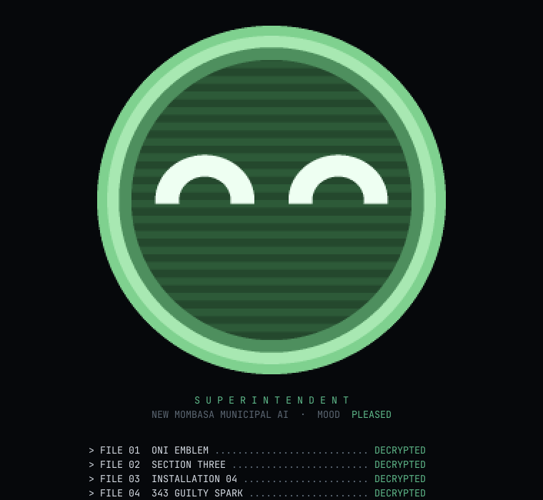
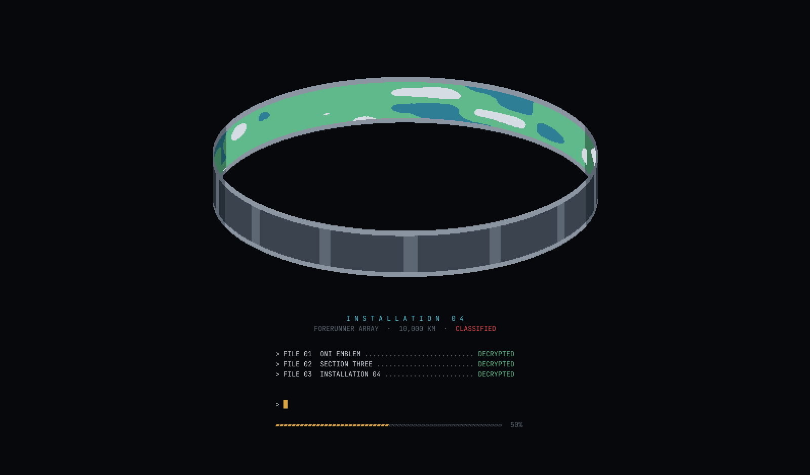
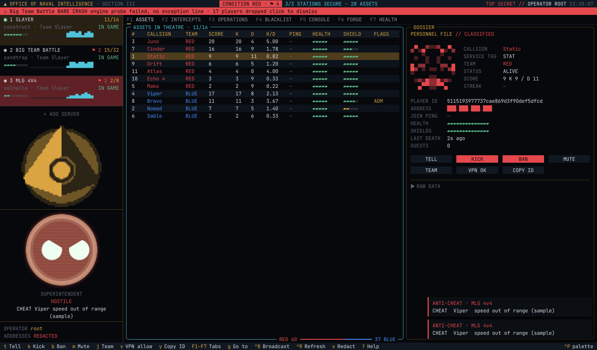

# ONI RCON desktop

The ONI console as a desktop app: a Rust backend (Tauri 2) and a React window. It does everything the terminal
console does, reads the same config file, and keeps its look: the masthead and CONDITION, the station cards, the
seven tabs, the dialogs, the field manual, the Halo ASCII Archive boot and the Superintendent.

<p>
  
  
</p>



## What's different

- **The art is drawn at four times the resolution.** The terminal had two pixels per character cell, so the
  emblem, the lattice, Installation 04, 343 Guilty Spark and the Superintendent were 48 pixels at most. Here each is
  drawn on a canvas at up to 260 pixels and shown with two screen pixels to one of its own, so it still reads as pixel
  art without the blocks:
  - The **Superintendent** is built from shapes (a disc, a rim, scanlines, two eyes), so it's sampled at 16 points per
    pixel at whatever size the sidebar has room for, up to 192 pixels across. Its blinks, glances, moods, wink and
    alarm pulse are the same state machine as before, at 30 frames a second while it moves and none while it's still.
  - The **traced grids** (the ONI emblem, Section Three's lattice) are upscaled by blending each tone and keeping the
    strongest, so staircases become clean diagonals and every colour is still one of the grid's own.
  - **Installation 04** and **Guilty Spark** are rendered from their formulas at the higher resolution, not upscaled.
- **It's lighter on a big fleet.** The backend gathers events for 40 ms and sends them to the window as one message;
  station cards repaint on the second, and only the ones whose content changed; the feed repaints at most five times
  a second however fast a fleet talks; the Superintendent re-samples its face only when its shape changes (an alarm's
  colour pulse is a recolour). It's been run against 80 servers sending about 16 events a second.
- **The Forge key never reaches the window.** It lives in the backend, goes only to reclaimerforge.net, and anything
  shaped like a key is blanked in whatever the backend sends to the window.
- **Updates are announced, not installed.** At start it checks GitHub for a newer release and says so with a link
  (`ONI_RCON_NO_UPDATE=1` turns that off). Signed self-updates need a signing key set up first.
- **Reduced motion follows the OS setting** (prefers-reduced-motion) instead of `TEXTUAL_ANIMATIONS`.

Everything else is the same: the setup screen, `--demo`, the command line (`oni-rcon 11774`, `--ssh`, `-c`, `--by`,
`--setup`, `--intro full|quick|off`, `--no-intro`), the config file and where it's found, `forge-state.json`,
`rounds.jsonl` and `prefs.json`, the keys, and every safety rule (a refused password is never retried, ABORT is the
default, addresses are redacted until `x`). The [main README](../README.md) documents all of it.

## Build

You need Node 20+ and Rust 1.80+. On Linux, also WebKitGTK:

```
sudo apt install libwebkit2gtk-4.1-dev build-essential libxdo-dev libssl-dev libayatana-appindicator3-dev librsvg2-dev
```

Then, from `desktop/`:

```
npm ci
npx tauri dev -- --demo   # a window with the demo, reloading as you edit
npx tauri build           # an installer in src-tauri/target/release/bundle
```

Tests: `npm test` (the window's logic and art) and `cargo test` in `src-tauri` (config, RCON, health, Forge,
installs, state).

## Where things are

| | |
|---|---|
| `src-tauri/src/rcon.rs` | the RCON WebSocket client and SSH tunnels |
| `src-tauri/src/hub.rs` | every connection, health report, Forge watch and install; batches events to the window |
| `src-tauri/src/health.rs` | crash and memory reports (F7) |
| `src-tauri/src/forge.rs`, `install.rs`, `fstate.rs` | ReclaimerForge: client, verified installs, what's installed where |
| `src-tauri/src/demo.rs`, `fakeforge.rs` | the demo's pretend servers, game box and Forge |
| `src/engine.ts` | stations, polling, commands and fan-out, events, alerts, the condition |
| `src/art/` | the palette, the upscaler, the archive's scenes, the Superintendent |
| `src/components/` | the sidebar, the tabs, the dialogs, the boot and the setup screen |
